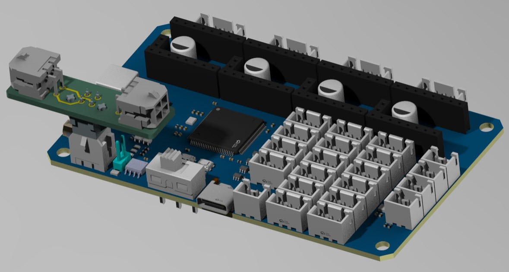
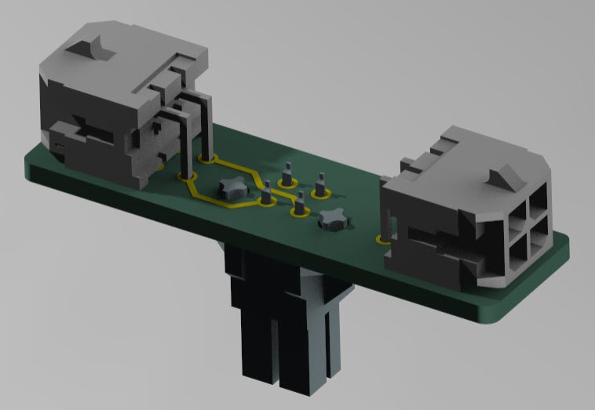

# CAN-Bus_connector
CAN-Bus_connector for 3D printer stuff

# Main goal
To provide a simple way to connect two or more CAN bus motherboards (AFC-light, EBB36/42, etc.).
It's a quick-and-dirty solution, but it's functional.

#  BOM

| Number | Part |
| ------ | ---- |
| 1 |  |
| 1 | Molex connector |
| 2 | Molex connector |

